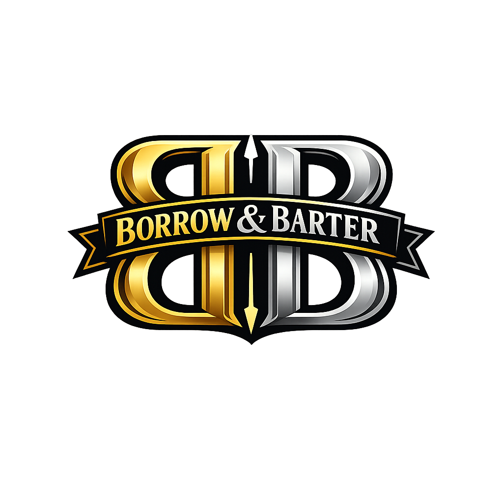

# Borrow & Barter

Borrow & Barter is a community marketplace for lending, buying, and trading useful items locally. Members can publish image-based listings, choose available dates, save favorites, contact listing owners, and request reservations from one responsive interface.



## Features

### Marketplace browsing

- Public marketplace with live Supabase listings
- Listing thumbnails and image galleries
- Category and location filtering
- Newest, location, and price sorting
- Borrow-only, buy-only, and borrow-and-buy listing modes
- Pricing, deposits, rental duration, location, and availability details
- Responsive layouts for desktop and mobile

### Accounts and authentication

- Email and password registration through Supabase Auth
- Email confirmation support
- Sign-in with functional **Remember me** behavior
- Forgot-password email and password recovery flow
- Protected listing, dashboard, and commerce routes
- Signed-in username displayed in the header
- Persistent or session-only authentication storage

### Listing management

- Authenticated listing creation
- Multiple image uploads to Supabase Storage
- Image preview before publishing
- Automatic 20% deposit calculation
- Custom availability calendar
- Owner-specific dashboard listing cards
- Clickable listing thumbnails and detail pages

### Favorites

- Add or remove a listing from favorites
- User-specific favorites protected with Row Level Security
- Clickable favorite cards on the dashboard
- Thumbnail, category, and location summaries

### Private messaging

- Listing-specific messages between authenticated users and listing owners
- Messages store sender and recipient identities
- Only message participants can read their messages
- Direct **Message lister** action on listing pages
- Distinct visual treatment for sent messages

### Reservations

- Begin a reservation from a listing page
- Choose from owner-provided availability dates
- Optional note to the listing owner
- Prevent users from reserving their own listings
- Reservation status model: `pending`, `approved`, `declined`, or `cancelled`
- Requests made and received appear on the dashboard

### Commerce planning

- Commerce UI describing supported payment options
- Proposed 3% marketplace commission
- Payout and provider guidance for Stripe Connect, PayPal, Adyen, or Square
- Payment security checklist in [PAYMENT_README.md](PAYMENT_README.md)

> Live payment processing is not active yet. The current commerce area is a frontend and implementation guide; production payments require a server-side provider integration and verified webhooks.

## Technology

| System | Purpose |
| --- | --- |
| React 19 | Component-based frontend |
| React Router 7 | Client-side routing and protected pages |
| Vite 8 | Development server and production builds |
| Supabase Auth | Registration, sessions, and password recovery |
| Supabase PostgreSQL | Listings, messages, favorites, and reservations |
| Supabase Storage | Public listing-image hosting |
| Supabase Row Level Security | User and participant-based data access |
| Oxlint | JavaScript and React linting |
| CSS | Responsive branded interface and interaction states |

## Application structure

```text
Borrow_and_Barter/
├── public/
│   └── logo.png
├── src/
│   ├── components/
│   │   ├── AvailabilityCalendar.jsx
│   │   ├── ImageViewer.jsx
│   │   └── WelcomePrompt.jsx
│   ├── lib/
│   │   └── supabase.js
│   ├── pages/
│   │   ├── AuthPage.jsx
│   │   ├── CommercePage.jsx
│   │   ├── CreateListingPage.jsx
│   │   ├── DashboardPage.jsx
│   │   ├── HomePage.jsx
│   │   └── ListingDetailPage.jsx
│   ├── App.css
│   ├── App.jsx
│   ├── index.css
│   └── main.jsx
├── supabase-schema.sql
├── SUPABASE_STORAGE_SETUP.md
├── PAYMENT_README.md
└── package.json
```

## Database model

### `listings`

Stores item details, ownership, pricing, listing mode, images, location, and available dates. Listings are publicly readable, but only authenticated users may insert a row owned by their own Supabase user ID.

### `messages`

Stores listing-linked private messages with `sender_id` and `recipient_id`. RLS limits reads to either participant and validates that new messages are addressed to the listing owner.

### `interests`

Stores favorites as a unique pair of `user_id` and `listing_id`. Users may only read, create, or remove their own favorites.

### `reservations`

Stores requested dates, notes, owners, requesters, and status. Only the requester and listing owner can read a reservation.

## Getting started

### Prerequisites

- Node.js 20 or newer
- npm
- A Supabase project

### 1. Install dependencies

```bash
npm install
```

### 2. Configure environment variables

Create a `.env` file in the project root:

```env
VITE_SUPABASE_URL=https://your-project.supabase.co
VITE_SUPABASE_PUBLISHABLE_KEY=your-publishable-key
```

Use the browser-safe Supabase publishable key. Never place a Supabase service-role key in this frontend project or commit secrets to source control.

### 3. Apply the database schema

Open **Supabase Dashboard → SQL Editor**, paste the complete contents of [`supabase-schema.sql`](supabase-schema.sql), and run it.

The script:

- Creates the application tables
- Adds upgrade-safe message columns
- Enables Row Level Security
- Grants the required API permissions
- Creates user and participant policies
- Creates or updates the `listings` storage bucket
- Adds authenticated upload and public-read storage policies

The schema is designed to be rerunnable: existing policies are dropped before being recreated, and the storage bucket uses an upsert.

### 4. Configure authentication URLs

In **Supabase Dashboard → Authentication → URL Configuration**:

1. Set the Site URL to the deployed application URL.
2. Add the local URL, usually `http://localhost:5173/auth`, to Redirect URLs.
3. Add the deployed `/auth` URL to Redirect URLs.

These URLs are required for confirmation and password-recovery links to return to the application correctly.

### 5. Run locally

```bash
npm run dev
```

Open the local URL printed by Vite.

## Available commands

| Command | Description |
| --- | --- |
| `npm run dev` | Start the Vite development server |
| `npm run build` | Create a production build in `dist/` |
| `npm run preview` | Preview the production build locally |
| `npm run lint` | Run Oxlint checks |

## Routes

| Route | Access | Description |
| --- | --- | --- |
| `/` | Public | Browse and filter marketplace listings |
| `/listings/:id` | Public | View listing details; sign-in required for actions |
| `/auth` | Public | Register, sign in, or recover a password |
| `/new` | Authenticated | Create and publish a listing |
| `/dashboard` | Authenticated | View owned listings, favorites, and reservations |
| `/commerce` | Authenticated | Review the planned commerce layer |
| `/payment-readme` | Public | In-app pointer to payment setup documentation |

## Security model

- The browser uses only the Supabase publishable key.
- PostgreSQL grants provide base table permissions.
- RLS policies decide which rows each user can access.
- Listing creation requires `owner_id = auth.uid()`.
- Favorites require `user_id = auth.uid()`.
- Messages are readable only by their sender or recipient.
- Reservation details are readable only by the requester or owner.
- Storage uploads require an authenticated session.
- Listing images are public so marketplace thumbnails can load for visitors.

## Image storage

Listing images are uploaded to the lowercase `listings` bucket. Bucket names are case-sensitive. The primary image is stored in `image_url`, while the complete gallery is stored in `image_urls`.

See [SUPABASE_STORAGE_SETUP.md](SUPABASE_STORAGE_SETUP.md) for manual storage setup and troubleshooting.

## Current limitations and next steps

- Add owner controls to approve or decline pending reservations.
- Add conversation grouping and owner reply controls for messages.
- Add listing edit, archive, and deletion actions.
- Add reservation conflict checking for overlapping approved dates.
- Replace commerce guidance with a server-backed payment provider.
- Add webhook processing for payments, refunds, and payouts.
- Add automated component, database-policy, and end-to-end tests.

## Troubleshooting

### `permission denied for table listings`

Run the full schema so both PostgreSQL grants and RLS policies are applied. A policy alone does not grant table access.

### Images do not upload

Confirm that:

- The bucket is named exactly `listings`.
- The user is signed in.
- The `storage.objects` insert policy exists.
- The frontend environment variables point to the same Supabase project.

### Favorites, messages, or reservations fail

Rerun `supabase-schema.sql`. These features require the `interests`, upgraded `messages`, and `reservations` tables plus their grants and RLS policies.

### Password-reset links return to the wrong page

Add the exact local and deployed `/auth` URLs to the Supabase authentication redirect allowlist.

## Additional documentation

- [Supabase and image storage setup](SUPABASE_STORAGE_SETUP.md)
- [Payment and payout planning](PAYMENT_README.md)

# Borrow_and_Barter
